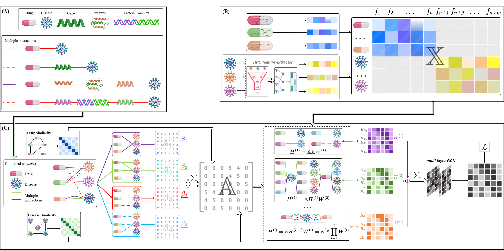

# RAMHGCN-DR: Relation-Adaptive Multiplex Heterogeneous Graph Convolutional Network for Drug Repurposing

RAMHGCN-DR implements a relation-adaptive graph representation learning framework for drug–disease association prediction and computational drug repositioning. It integrates direct drug–disease associations, three projected biomedical relation channels, molecular structure descriptors, phenotype annotations, and within-type similarity networks. The resulting node embeddings support relation-wise evaluation and the prioritization of previously unobserved drug–disease pairs.

<p align="center">
  
</p>

<p align="center">
  <em>Overall architecture of the RAMHGCN-DR</em>
</p>

This repository contains the source code, fixed biomedical input snapshots, processed model inputs, configuration files, and command-line workflows for preprocessing, cross-validation, evaluation and ablation analysis. 

## 1. Source-code organization

```text
RAMHGCN/
├── configs/
│   ├── ramhgcn.yaml                 # Model, evaluation, and runtime settings
│   └── preprocessing.yaml           # Raw inputs and feature/relation construction
├── data/
│   ├── raw/
│   │   ├── associations/            # Direct associations and gene membership tables
│   │   ├── entities/                # Ordered disease identifiers
│   │   ├── features/                # Drug SMILES and HPO annotations
│   │   └── similarity/              # Weighted within-type edge lists
│   └── processed/
│       ├── multiplex_graph.mat      # Features and base relation matrices
│       ├── DrugDiseaseID_with_names.xlsx
│       ├── manifest.json            # Dataset metadata and input SHA-256 hashes
│       └── splits/                  # train.txt, valid.txt, test.txt, all_edges.txt
├── scripts/
│   ├── check_environment.py         # Compare runtime versions with declared pins
│   ├── prepare_data.py              # Rebuild features, relations, and source splits
│   ├── run_end_to_end.py            # Train, evaluate, and optionally rank candidates
│   ├── run_full_pipeline.py         # Preprocess, then train/evaluate/rank
│   ├── run_ablation.py              # FULL and four relation-channel ablations
├── src/
│   ├── config.py                   # Configuration validation and path resolution
│   ├── data.py                     # MAT, mapping, and labelled-example loading
│   ├── similarity.py               # Similarity filtering and matrix assembly
│   ├── graph_input.py              # Adjacency stack and optional normalization
│   ├── splits.py                   # Deterministic relation-wise CV partitions
│   ├── model.py                    # Relation-adaptive encoder and dot-product decoder
│   ├── training.py                 # Optimization and checkpoint selection
│   ├── metrics.py                  # Per-relation metrics, thresholds, and summaries
│   ├── experiment.py               # Experiment orchestration and artifact writing
│   ├── ranking.py                  # Complete and bidirectional candidate rankings
│   ├── runtime.py                  # Seeding, devices, hashing, and provenance
│   ├── preprocessing/
│   │   ├── chemistry.py            # Atom descriptors from drug SMILES
│   │   ├── hpo.py                  # Disease–HPO features and information content
│   │   ├── relations.py            # Biomedical path projection
│   │   ├── export.py               # Indexed matrices, negative sampling, and splits
│   │   └── pipeline.py             # Preprocessing orchestration and manifests
├── environment.yml                 # Conda environment with CUDA 11.8 runtime
├── requirements.txt                # Pinned Python dependencies
├── pyproject.toml                  # Packaging and ramhgcn console entry point
└── README.md
```

## 2. Step-by-step execution from processed inputs

### Step 1 — Create an environment

From the directory containing `RAMHGCN`, run:

```bash
cd RAMHGCN
```

For the supplied Conda environment, which includes the CUDA 11.8 runtime:

```bash
conda env create -f environment.yml
conda activate ramhgcn
python -m pip install -e . --no-deps
```

### Step 2 — Run preprocessing

```bash
python scripts/prepare_data.py \
  --config configs/preprocessing.yaml \
  --output-dir outputs/inputs
```

### Step 3 — Run training

```bash
python scripts/run_end_to_end.py \
  --config configs/ramhgcn.yaml \
  --output-dir outputs/main_run
```

### Combined preprocessing and training command


```bash
python scripts/run_full_pipeline.py \
  --preprocess-config configs/preprocessing.yaml \
  --experiment-config configs/ramhgcn.yaml \
  --data-output-dir outputs/inputs_combined \
  --run-output-dir outputs/combined_run
```

## 3. Relation-channel ablation analysis

```bash
python scripts/run_ablation.py \
  --config configs/ramhgcn.yaml \
  --output-dir outputs/ablation
```

This executes five settings sequentially, each with the same seed, folds, optimization settings, and evaluation rules:

| Setting | Encoder channel assigned zero weight |
| --- | --- |
| `FULL` | None |
| `DROP_DD` | `DD` |
| `DROP_DGD` | `DGD` |
| `DROP_DPD` | `DPD` |
| `DROP_DCD` | `DCD` |

